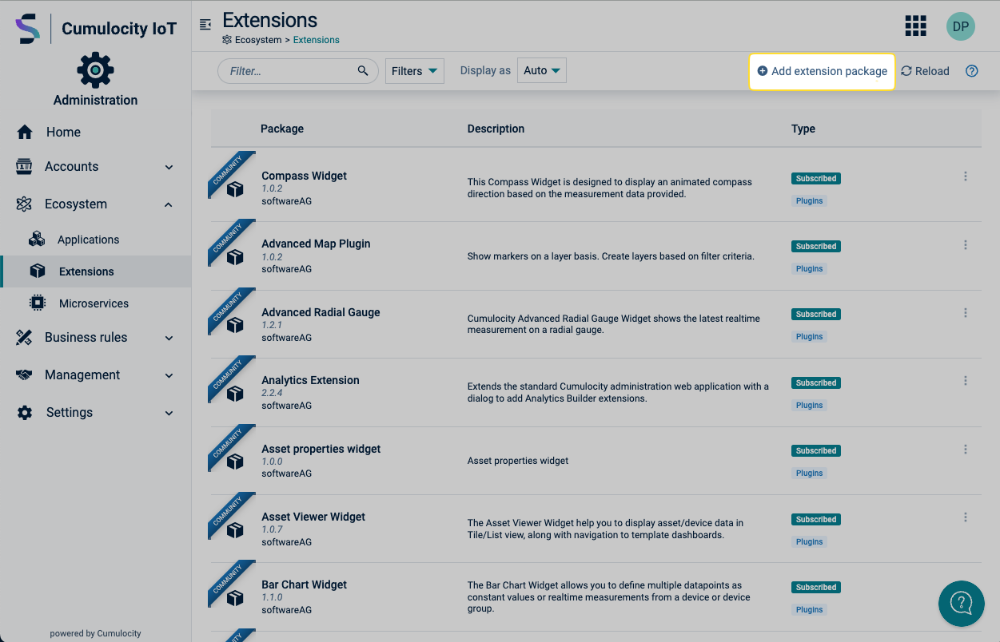
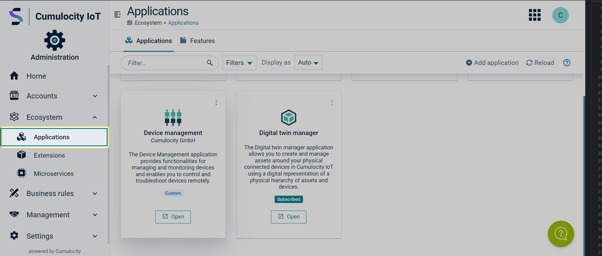

# cumulocity-flexy-integration-ui

## How to install the Plugin

1. Navigate to the "Ecosystem" » "Extensions" page in the administration app (path: `/apps/administration/index.html#/ecosystem/extension/extensions`).  
  
  Click on the "Add extension package" button, located on the right side of the action bar, to open the dialog.
1. Select the package (.zip) by clicking on the "Drop file here" area, or drag and drop it in the same place.  
  
1. TODO after upload dialog/confirm
1. Once sucessfully installed the plugin should be listed within the extensions.  
  
1. Navigate to the "Ecosystem" » "Applications" page (path: `/apps/administration/index.html#/ecosystem/application/applications`)
1. Click on the "add application" button, again on the right side of the action bar.  
  
1. In the "Add application" dialog, proceed through following steps as following:
    1. Choose "Duplicate existing application"  
      
    1. Click on "Device management"  
      
    1. Submit the dialog by clicking "Duplicate", without making further changes.  
      
1. Navigate to the "Ecosystem" » "Applications" page in the administration app (path: `/apps/administration/index.html#/ecosystem/application/applications`).  
  
  Click on the Device management application flagged as 'custom' (don't click the "open" button).
1. Click on the "Plugins" page (path: `/apps/administration/index.html#/ecosystem/application/applications/<ApplcationID>/plugins`)
      
1. On the "Plugins" page, proceed through following steps as following:
    1. Choose "Install plugins"  
      
    1. Select and install "HMS Flexy Integration Plugin".  
      
1. Access the duplicated "Device management" application via the app switcher.  
  
1.  The "Devices" » "Flexy Registration" navigation item should now be avilable to you.
  

------------------------------
  
This widget is provided as-is and without warranty or support. They do not constitute part of the Software AG product suite. Users are free to use, fork and modify them, subject to the license agreement. While Software AG welcomes contributions, we cannot guarantee to include every contribution in the master project.
